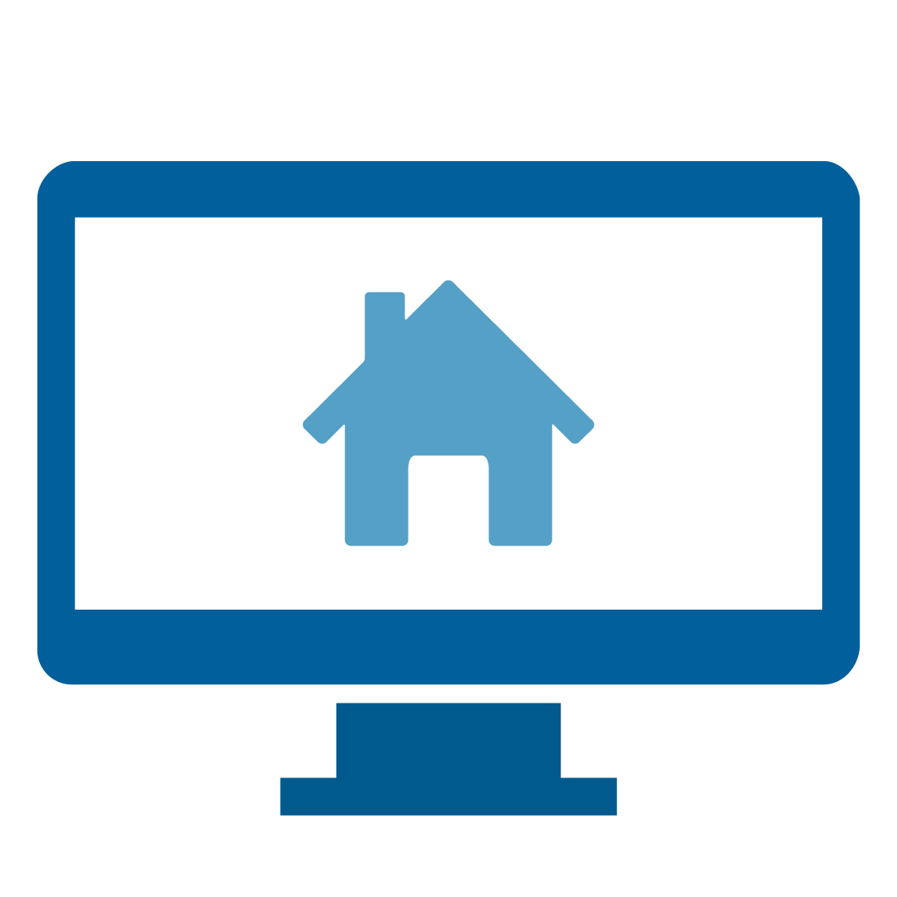
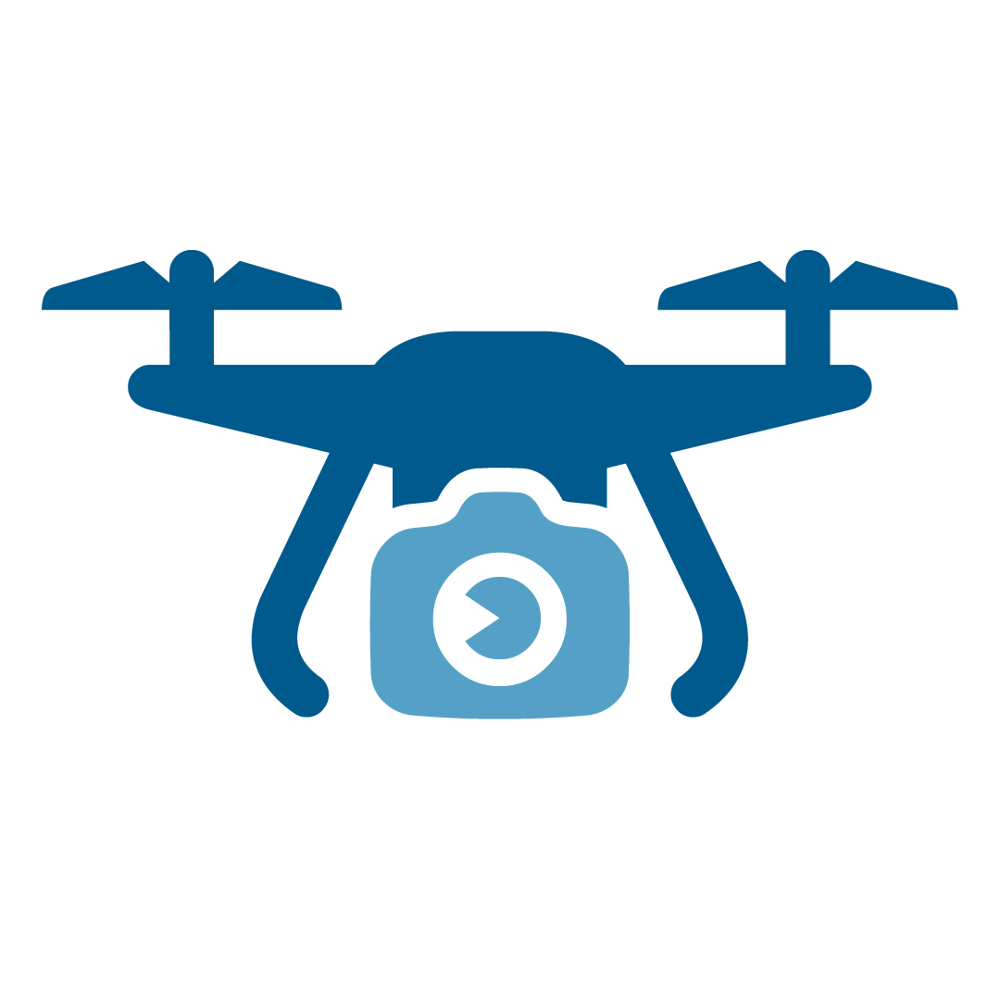
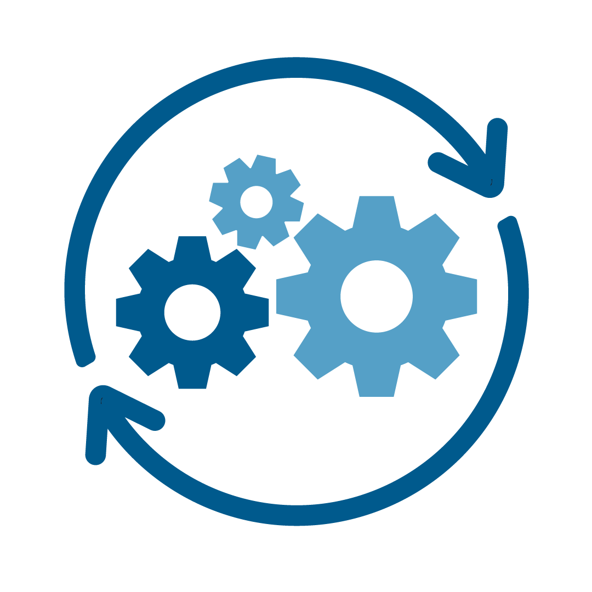
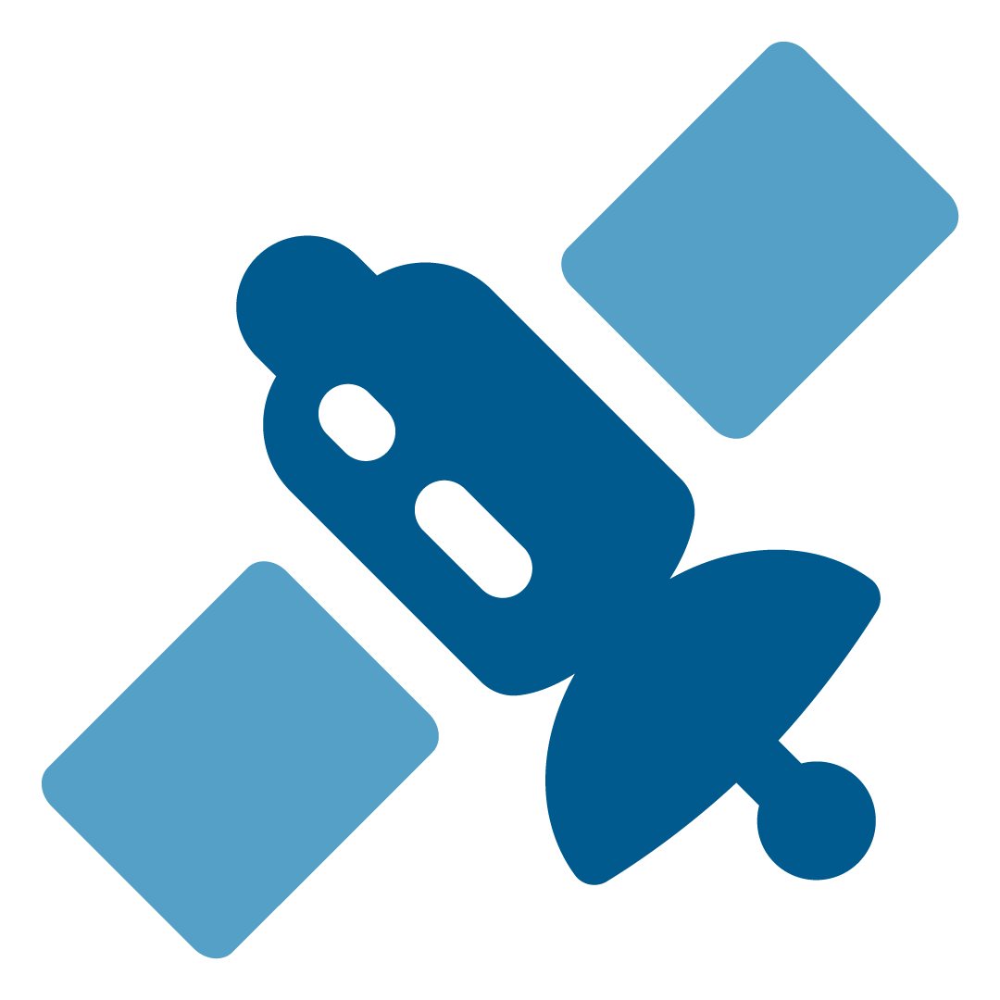
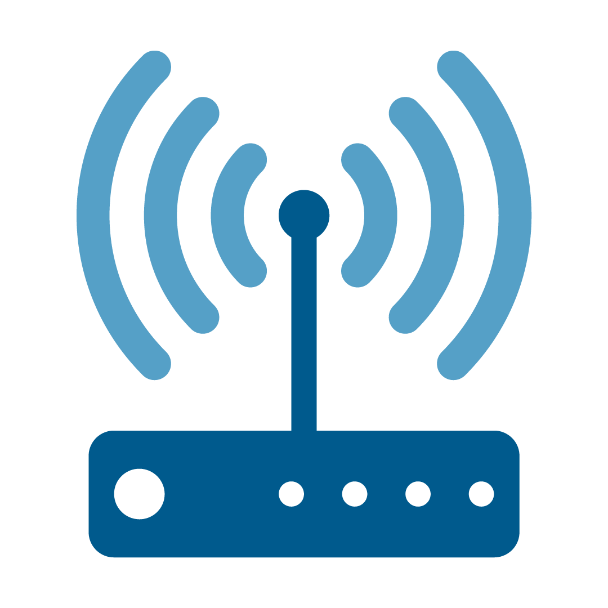

# Welcome to D4D tools

Below you will find Fact Sheets on Technical and Digital Tool Types used in financial cooperation. They provide background information on when and why a specific tool is relevant for a Financial Cooperation project. They describe what project partners and suppliers need to know regarding their respective usefulness for the project’s objectives, implementation options as well as interoperability and legal requirements. They also list Use Cases and links to further sources.

## A quick overview

<figure>

<figcaption><a href="bim">Building information modelling</a> is a cutting-edge method  for integrated design, construction, and operation of infrastructure projects.</figcaption>    
</figure>

<figure>

<figcaption> <a href="cameras">Cameras</a> are manual or automatic optical instruments to capture static
  and omnidirectional photos, virtual reality or videos.</figcaption>    
</figure>

<figure >

<figcaption><a href="collaboration">Collaboration platforms</a> are software applications designed
  to optimize the interactions or "group processes" for people working on a common task.</figcaption>    
</figure>

<figure >

<figcaption><a href="cst">Crowdsourcing</a> can be used to quickly collect up-to-date information from many individuals at relatively low cost, especially from target groups.</figcaption>    
</figure>

<figure >

<figcaption><a href="drones">Drones</a> can be helpful in providing aerial imagery for monitoring
  agriculture, wildlife, the environment, and infrastructure.</figcaption>    
</figure>

<figure >

<figcaption><a href="elearning">eLearning</a> tools are primarily web-based software to deliver training
  and content across a variety of electronic devices.</figcaption>    
</figure>

<figure >

<figcaption><a href="gis">Geospatial tools</a> are designed to collect, 
istore, edit, manipulate and analyze different types of geospatial data in layers of 
maps.</figcaption>    
</figure>

<figure >

<figcaption><a href="mms">Maintenance Management Systems</a>  are used to manage maintenance operations and optimize the utilization and availability of equipment and infrastructure.</figcaption>    
</figure>

<figure >

<figcaption><a href="mdc">Mobile Data Collection</a> tools are used for collecting information from the field via mobile devices such as a smart-phones, tablets, or GPS trackers.</figcaption>    
</figure>

<figure >

<figcaption><a href="rmis">Remote anagement Information Systems</a> are useful for tracking infrastructure quality and the progress of complex projects.</figcaption>    
</figure>

<figure >

<figcaption>Earth Observation <a href="satellites">via satellites</a> is a discipline that allows us to gather
  information about our planet. </figcaption>    
</figure>

<figure >

<figcaption>  A <a href="sensors">sensor</a> is a device that monitors changes by converting signals continuously and automatically from analog objects into a digital interface . </figcaption>    
</figure>
